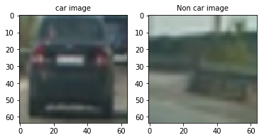
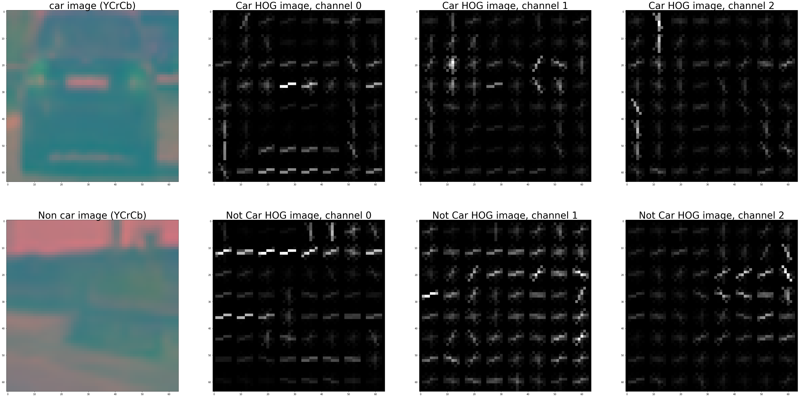
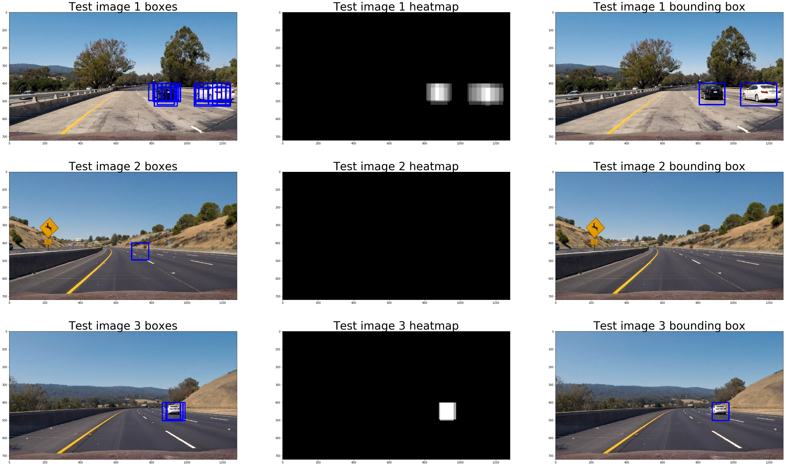

**Vehicle Detection Project**

The goals / steps of this project are the following:

* Perform a Histogram of Oriented Gradients (HOG) feature extraction on a labeled training set of images and train a classifier Linear SVM classifier
* Optionally, you can also apply a color transform and append binned color features, as well as histograms of color, to your HOG feature vector. 
* Note: for those first two steps don't forget to normalize your features and randomize a selection for training and testing.
* Implement a sliding-window technique and use your trained classifier to search for vehicles in images.
* Run your pipeline on a video stream (start with the test_video.mp4 and later implement on full project_video.mp4) and create a heat map of recurring detections frame by frame to reject outliers and follow detected vehicles.
* Estimate a bounding box for vehicles detected.

[//]: # (Image References)
[image1]: ./examples/car_not_car.png
[image2]: ./output_images/hog_visualization.png
[image3]: ./output_images/sliding_windows.png
[image4]: ./examples/sliding_window.jpg
[image5]: ./examples/bboxes_and_heat.png
[image6]: ./examples/labels_map.png
[image7]: ./examples/output_bboxes.png
[video1]: ./project_vid_output.mp4

## [Rubric](https://review.udacity.com/#!/rubrics/513/view) Points
###Here I will consider the rubric points individually and describe how I addressed each point in my implementation.  

---
###Histogram of Oriented Gradients (HOG)

####1. Extracting HOG features from the training images.

The code for this step is contained in the code cell# 1 of the IPython notebook (in lines 17 through 34).

I started by reading in all the `vehicle` and `non-vehicle` images.  Here is an example of one of each of the `vehicle` and `non-vehicle` classes:

I then explored different color spaces and different `skimage.hog()` parameters (`orientations`, `pixels_per_cell`, and `cells_per_block`).  I grabbed random images from each of the two classes and displayed them to get a feel for what the `skimage.hog()` output looks like.

Here is an example using the `YCrCb` color space and HOG parameters of `orientations=8`, `pixels_per_cell=(8, 8)` and `cells_per_block=(2, 2)`:

####2. Choosing optimal HOG parameters

I experimented with various combinations of `orientation`, `pixels_per_cell`, `cells_per_block` and `channels`. I trained the classifier with different setting, I got the best classifier accuracy for
`orientation=9`
`pixel_per_cell=(8,8)`
`cells_per_block=(2,2)`
`channels=ALL`

####3. Classifier for HOG features
I wrote a function called `extract_features`, located in cell 1 from line 107, which first converts the image color format to different color spaces (specified through an input param) and then calls the `extract_hog_features` function to extract the hog features for different color channels, it then combines the features into a single feature vector. This allowed me to experiement with different hog settings quickly. I trained an SVM classifier using the provided labeled dataset with car and non-car examples. I used the `sklearn.svm.LinearSVC` class for creating the classifier. 

###Sliding Window Search

####1. Sliding window design
I implemented the function `slide_window`, in cell 1 from line 197, to isolate small portions of the image that can be fed to classifier to identify a car. I tried various sizes and overlap ratios of the sliding window using the code in cell 50. I found that `window_sizes=64/96/128` and `overlap=(0.5, 0.5)` worked the best. The windows of sizes 64, 96 and 128 clearly captured cars in test images at various distances.
I also limited the search area to the lower half of the image since the cars are always present in that region.

![alt text][image3]

####2. Pipeline optimizations with some examples
The image below shows the pipeline for identifying cars in the provided test images. For getting the best results I combined the HOG features for all three color channels along with the spatial and color histogram features while training the classifier. The code for extracting all the features is implemented in cell 1 from line 107.

Ultimately I searched on three scales using YCrCb 3-channel HOG features plus spatially binned color and histograms of color in the feature vector, which provided a nice result.  Here are some example images:

---

### Video Implementation

####1. Using the pipeline on the project video
Here's a [link to my video result](./project_vid_output.mp4)

####2. False positive detection using heatmap and bounding boxes

After using the sliding window to find positive windows I created a heatmap and then thresholded that map to identify vehicle positions.  I then used `scipy.ndimage.measurements.label()` to identify individual blobs in the heatmap.  I then assumed each blob corresponded to a vehicle.  I constructed bounding boxes to cover the area of each blob detected. 
The code to detect false positives is implemented in the three functions in cell 4. The code to test the implementation on some example frames is in cell 74. 
Here are some examples showing the heatmap and corresponding bounding box. Notice that in the second example the false positive is eliminated since the heatmap ignores the single positive detection, when there is no car in the frame.

---

###Discussion

Here I'll talk about the approach I took, what techniques I used, what worked and why, where the pipeline might fail and how I might improve it if I were going to pursue this project further.  
####1. Issues faced during implementation of this project
* `Too many parameters to tune`: The biggest issue was finding the optimal setting for the large number of tunable parameters in this project. There were HOG params, sliding window params, classifier, etc. It took a long time to experiment various settings to see what works best.
* `Challenging project video`: The project video is a bit challenging with light patches on the road and cars coming from the opposite direction. It requires many iterations to resolve each case of missed detection and false positives.

####2. Where will the pipeline fail
* `Larger region of interest`: The pipeline works on the assumption that all cars will be found in the bottom half of the frame, which may not be valid in hilly areas during steep climbs.
* `Different weather conditions`: Some parameters settings may not work very well if the light conditions in the video are different from the project video, e.g. hazy, cloudy or night time.
* `Different vehicle types`: If the vehicles on the road are very different from what are present in the provided training sets, e.g. military vehicles in the war zone with camouflage paint. 

####2. How to make the pipeline more robust
* `More training data`: Train the classifier on more training data with different types of vehicles in different types of environments.
* `Test in various road and weather conditions`: Test the pipeline on a different typed of roads like mountain roads, desert roads, etc. Also test with videos recorded in foggy weather or at night.
* `Denser, faster and slower traffic`: Test the pipeline with a) more cars, b) faster moving cars, c) slower moving cars like stop and go traffic. And tune the parameters accordingly.

